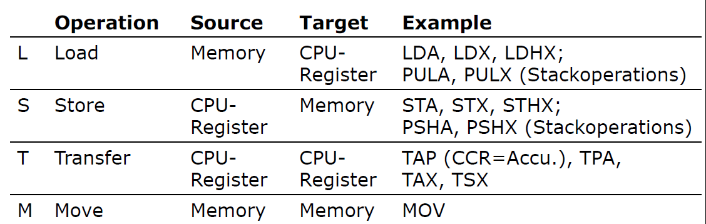

# Control Questions
## SW01_MC_Slides_B1
### 1. Turn -4 (from two‘s complement), into a 6-bit Hex-number       
| Comment | Command |
|---------|---------|
|         | 0xFFFC  |
| Inv     | 0x0004  |
| +1      | 0xFFFB  |
|         | 0xFFFC  |
### 2. How many bits storage space are in a 32 K x 8 memory? How many address lines are in the memory? What‘s the highest address (Hex) within the memory?
2^5 * 2^10 * 2^3 = 2^18 = 2^16 * 2^2
32 * 1024 * 8
> Remember :
1 K = 210=   1024 Bit b= 10 address lines for 1kx1 RAM
64 K = 216= 65536 Bit b= 16 address lines
### 3. What‘s the difference between a microcontroller and a microprocessor?
Microcontroller hat alle Komponente CPU, RAM, ROM usw.
Mikroprocessor geht es hauptsächlich um CPU
### 4. What are the 3 main system components of any microcontroller?
CPU, RAM, ROM
### 5. Which 3 types of busses are in a MCU? Which of those are bidirectional?
* Controll Bus
* Data Bus
* Address Bus
### TODO 6. List the components within a CPU.
### 7. Steps within a instruction set cycle?
* Instruction Fetch
* Instruction Decode
* (Operand Fetch)
* Instruction Execute
* Next Address
### 8. What types of registers are in a MCU?
* AKKU
* OP Register
* Instruction Register
* PC
## SW01_MC_Slides_B2
### 1. List the main function groups of the MC-Car.
See "MC-Car Detail Schema" for all information
* Two Red LEDs at the back
* Some at the front
* Yellow next to the colour sensor
* Infared Senor for Wheels, Remote
* Buzzer
* Joystick
* Accelerometer (not in use)
* Battery
* Two Motors and Hbridge
* Microcontroller
### 2. How can you upload a new image to the MC-Car? 
through the Computer via USB Cable.
See Slide 11 from presentation "Part 2"

### 3. Under which circumstances would you program a MCU with Assembler?
For Time Critical Programming. Efficiency. Sometimes the compiler doesn't see certain optimisations which a human can see
### 4. TODO What kind of information will you find in the Parameterfile (*.prm)? 
Configuration reasons
MC_Slides_B3
Instructions are translated in Maschine Code
Directives are not directly directed in Maschine Code. Gets already handled in the Pre-Assembler Sequence
## SW02_MC_Slides_B3
### 1. List theregistertypesofthe HCS08-CPU. 
* Stack point
* Akkumolator
* H_X Register, General Purpose
*  Condition Code Register
### TODO 2. Which registers does the Microsim-Simulator contain, that are not present in the HCS08-CPU?
### 3. Which address is used, to control the Data Direction Register of port D?
* PTGDD0x000DPort G Data Direction Register
### TODO 4. Which pros and cons has the instruction combination LDA/STA over the MOV instruction?
### 5. What ist a CCR?
Condition Code Register, in there lies Carry, Zero, negative, interrupt mask, half-carry (from bit 3), two's complement overflow

## SW03_MC_Slides_B4
### 1. What will be executed with the assembler directive DS.W 3?
Will Allocate the memory with 3 words.
### 2. How many bus cycles are necessary for the execution of theinstruction „LDA $10A1“?
4 Cycles
### TODO 3. Why is there no STA-instruction with immediate addressing mode?
Where is it suppose to go? Doesn't make sense
### 4. Explain specifically the functionality of indexed addressing mode SP2!
Similair to IX2 but uses Stackpointer
### 5. How many Bytes program memory are used for the instruction„LDHX $5B,SP“?
3 Bytes (2 Bytes for (Special)command, 1 Byte for adressing
### 6. Explain the jump address range of the relative addressing mode!
* 8 bit Value signed with Offset of + 2 (Hardware manufacturer made this to confuse you)
* The address range with relative addressing is -126 to +129.
* **Relative** for branches, PC=PC+2+two's complement.
## SW03_MC_Slides_B5
### 1. List different kinds of Transport-Operations.

### 2. What does the operation TAP do on the HCS08 CPU?
TAP -> Transport Accumulator to Condition Code Register
### 3. List the arithmetic flags (Condition Codes) of the HCS08 CPU.
ConditionCodes

### 4. In which register of the HCS08 is the result saved after an arithmetic operation?
In den meisten Fällen (50%) in den Akkumulator, z. B. In der Multiplikation landet es im X Register
### 5. How does the ALU distinguish between signed and unsigned values while executing ADD and SUB operations?
Das entscheidet der Programmierer
## SW04_MC_Slides_B6
### 1. What‘s the difference between COMA and EOR #$FF ?
* COMA uses 1 Byte 1 Cycle and sets Carry bit to 1
* EOR uses 2 Bytes 2 Cycles and leaves Carry Bit alone
### 2. How many cycles are used for the execution of the operation BCLR respectively BSET and why?
Both need 5 cycles, beacause it does alot of stuff
### TODO 3. Which Flag-combination is tested by the operation BGE and why?
Zu prüfen ob ein negativer Wert nicht durch ein under/overflow entstanden ist. z.B -100 -30 = 
### 4. Why does the operation BRN even exist in the instruction set of the HCS08-CPU?
Is for debugging purpuses. Is used as Breakpoints
## SW05_MC_Slides_B7
### 1. Explain the **principle** of a **Stack**-Memory.
*  First in Last Out
* Last in First Out
### 2. **How** does the stack gets **initialised** in a CW-Project?
You have to initialise the stackpointer. Reserve part of memory. Declare. Points on Top
### 3. What **kind of information** is stored on the stack?
* Return address
* Local variables
* parameters
### 4. What kind of information **cannot** be stored on the stack?
Global variables. Everything that is declared before the stack
### 5. List pros and cons of Subroutines.
#### Pros
* Repeated command seuences are stored only once in memory => **less memory usage**
* Repeated command sequences are programmed and tested only once => **less development effor**
* Programms can be built in a modular way => **lower risk of errors**
* Progrgams can be developed parallel by multiple persons at the same time => **higher productivity in Team**
* Parts of the program can be compiled independent of each other => **shorter  compile time, libaries with standard functions**
#### Cons
* The call of the subroutine, parameter passing and the return jump need additional time => **slower** program execution.
### 6. Which types of parameter passing do you know, and how are they realised within the HCS08?
* CPU register
* Accumalator
* X:H Register
* Called by Value and Called by reference (Zu verallgemeinert)
## SW06_MC_Slides_B8
### 1. What is the use of Interrupts?
Simple explaination: In order to react to stuff from outside.
OCD Answer: Adjust the Interrupt flag. Saves the context in Stack. Executes interrupt. Clear Flag. Get Context 
### 2.  Name pros and cons of Polling- and Interrupt modes?
1. Interrupt = Exception handling
  + **Fast reaction time** through automatic reaction to events and interrupt of the program to execute an Interrupt-Service-Routine (ISR) => **realtime capable** systems possible (depends on interrupt **latency**)
  - Substancial effort for state backup, because the instant of time of the program interruption is unknown
2. **Polling** = cyclic requests
  + **Shorter** program **interruption**. Because the instant of time is known during programing, the state can be backed up more efficient
  − **Waste of calculation time** if events occur seldom
• Each MCU holds an Interrupt-Logic to realise real-time systems.
### 3. What is an ISR?
Interrupt-Service-Routine
###TODO 4. What is the difference between ISR and Subroutine?
Interrupt-Service-Routine is spontanious 
###TODO 5. What are Interrupt vectors and how do they work?
* ? Einfach  erklärt liste von Interupts in Array form.
* Es gibt normale Interrupts 
### 6. How many Bits does a counter holds in a timersystem of MC9S08JM60?
16 bits
### 7. How can you set the counters to a specific value from SW?
You can't set it to a specific value
### 8.What do you have to do, to read out consistent counter values each time?
Also difficult to not possible, because it take to long to read it out. See Shadow register for more information (quick fix)
### 9. Why do you realise delays with the timer system and not with NOP operations?
Timer system saves CPU time and save power
## SW07/08_MC_Slides_B9/B10
### 1. To which general application cases do both timer operation modes Output-
Compare (OC) and Input-Capture (IC) conform to?
* OC The Clock is driving the Counter and compares
* Stopwatch mode, Wait until something happens and then you measure time
### 2.  Explain the functionality of the Value-Registers in the timer operation modes OC and IC.
IC Read Value Register and then will tell you when it happend
### 3. Why is it advantageous to use the timer module with the modulo value of 0xFFFF?
If you change the modulo it would change all the values. 
### 4. How can you generate a Output-Compare Interrupt with the timer, without changing the value at the port-pin?
Choose output compare mode.
### 5. TODO Name the two operation modes of a Logic Analyzer and explain their differences.
## SW09_MC_Slides_B11
### 1. How do you set the period length and the duty cycle of the generated signal with Edge-Aligned PWM?
* By Lowering the modulo Register
* Sett different value at value register
### 2. Why is it better to use TPM2 instead of TPM1 to generate the PWM-signals for the left and right motor of the MC-Car?
TPM02 Has only 2 channel and we need only two. TPM01 has 6 channel therefore it would have been a waste
### 3. What do you have to consider when you generate a signal with 100% Duty Cycle?
* Value has the be at least one more than the modulo
### TODO What is the pro and con of the operation mode Center-Aligned PWM?
#### Pro
* You can increase the resolution
#### Con
* Shouldn't be on top of eachother
## SW09_MC_Slides_B12/13
### 1. How many wires are used by the IIC-Bus?
Two wires, one fpr Clockwork and one for date. There is actually an additional hidden ground wire so
### 2. Whit which Bitrate does the IIC-Bus work?
100 KHz
### 3. Which driver stages are used by the IIC-Bus participants and why?
Open-Drain Output stages, avoids short circuit
### 4. When is it allowed to change data on the SDA-wire?
When the clock is on Zero, 
### 5. How is Start and Stop of a transmission signalled?-
When clock is Zero -> Start. When clock on one ->Stop
### 6. IIC-Bus: How is the decision done which participant acts as Master or Slave?
Depends on the configuration. Some MCU can be both. Normally most hardware is a slave
### 7. IIC-Bus: How is the decision done which participant acts as Sender or Receiver?
R/W Bit of the 
### 8. IIC-Bus: For what is the Repeated-Start Condition?
* To adjust several W / R procedures.
* You could also use it if you want to address several slaves but it is rare
## SW11_MC_Slides_B14/15
### 1. How many wires are used by a RS-232-Interface for data
transmission?
2 Wires, Jedoch 3 Wires in der Realität empfohlen für Ground
### 2. Why doesn‘t RS-232 use a Clock-wire (compared to IIC)?
 Because its asynchronous
### MEPFRAGE 3. How many data bytes can you transmit per second with 9600 Baud/s and a RS-232-Format of 8-No-1? // MEP Frage, muss man mit pen & paper können
* 9600 / 10 
* Are Startbit, Endbit and Information. Parity doesn't count
* 
### TODO 4. How do you explain the factor 16 on the calculation of the BR-value for the SCI-Module of MC9S08JM60?
## SW12_MC_Slides_B16
### 1. Explain the principal of the A/D-Conversion with successive
approximation.
Like Binary search but on the Hardware side
### 2. How many channels does the A/D-Converter hold in MC9S08JM60?
12 Channels
### 3. How many analog signals can be converted by the A/D-Converter in MC9S08JM60 at the same time?
only one at a Time
### 4. Which bit-resolutions are supported for reading analog signals with the MC9S08JM60?
8, 10 and 12 bit